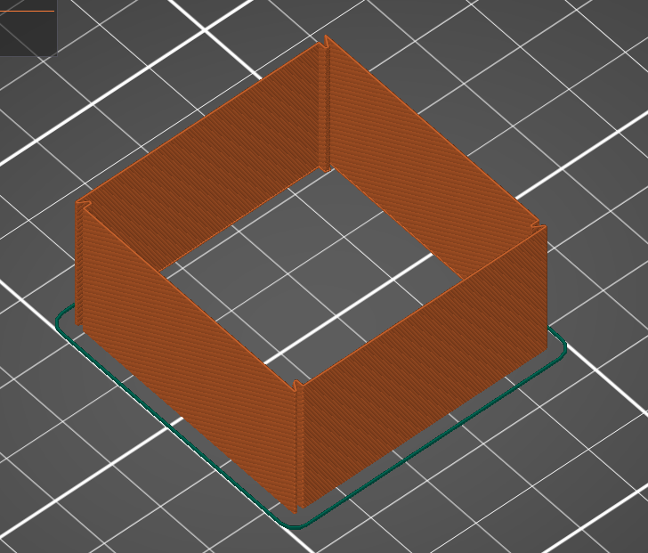

# Belt tension data sharing platform

## Table of content:

### [Introduction](#introduction-1)

### [How to find exsisting results](#how-to-find-exsisting-results-1)

### [How to perform the test](#how-to-perform-the-test-1)

### [How to submit your test results](#how-to-submit-your-test-results-1)

### [Orgnization of the data](#orgnization-of-the-data-1)

## Introduction:

This repository serves as a timing belt tension data sharing platform for all 3D printing enthusiasts. Since there are too many different models and types of 3D printers for us to test them all. We decided to create this platform for everyone to share their test results, and to make it easier for everyone to find the most suitable timing belt tension for their printers.

## How to find exsisting results:

- You can find the optimum tension data in the **[data folder](./data)**. The **data folder** is orgnaized as shown [here](#orgnization-of-the-data-1)

## How to perform the test:

- Get the [tension_data_template](./templates)

- Follow the Guide [here](https://prorifi3d.com/pages/how-to-tune-your-timing-belt) to change the tension of the belt.

- For the test print
	- Use Black PETG
	- 0% infill
	- No top and bottom layers
	- 1 layer of vertical shell
	- 0.15 mm layer height
	- **Same constant printing speed for the entire test print**
	- **If there is a stock Quality mode in the Slicer software for your machine, test the stock Quality mode first.**

## How to submit your test results:

- Test result should be submitted via the form of "Pull request"

- To do this, fork the repo first

- Navigate to the folder of your machine. If it is not created yet, created the folder following this [structure](#orgnization-of-the-data-1)

- Create a folder with name **[Model]-[Optimum tension]-[Provider]**

- Fill the tension data template, rename it with **[Model]-[Optimum tension]-[Provider]**, put the data and other evidence such as photos under the folder you just created.

- Note that the **Optimum tension** is in unit of *lb*

- Start a "Pull request"

## Orgnization of the data

- The data is sorted in the following order

- data
     - Brand
        - Model
			- Modded
				- [Model]-[Optimum tension]-[Provider]
					- [Model]-[Optimum tension]-[Provider].csv
					- (photo evidence)
					- ...
			- Stock
				- [Model]-[Optimum tension]-[Provider]
					- [Model]-[Optimum tension]-[Provider].csv
					- (photo evidence)
					- ...

